# Cloud Firestore Android Codelab

## Overview
Duration: 1:00

### Goals

In this codelab you will build a restaurant recommendation app on Android backed by Cloud Firestore. You will learn how to:

*   Read and write data to Firestore from an Android app
*   Listen to changes in Firestore data in realtime
*   Use Firebase Authentication and security rules to secure Firestore data
*   Write complex Firestore queries

### Prerequisites

Before starting this codelab make sure you have:

*   Android Studio 2.3 or higher
*   An Android device or emulator

## Create a Firebase project
Environment: kiosk

The codelab kiosk you are using already has an existing Google Cloud project. Import that project into Firebase to use it for this codelab:

1. Go to the[ Firebase console](https://console.firebase.google.com/).
1. Select **Add Project**.
1. In the drop down, select the existing Google Cloud project (see image below).
1. Click **Add Firebase.**

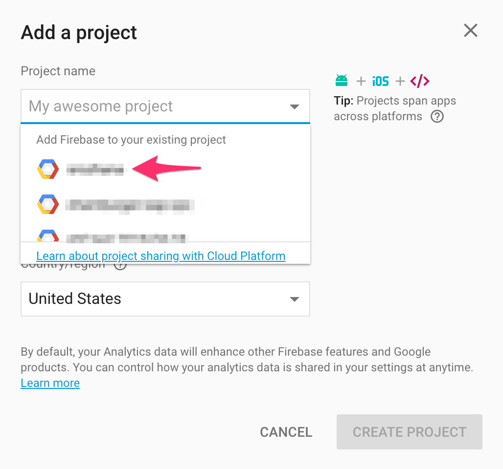

## Create a Firebase project
Environment: web

For this codelab, create a new Firebase project to work with:

1. Go to the [Firebase console](https://console.firebase.google.com/).
1. Select **Create New Project**, choose any name you want.


## Set up the sample project
Duration: 5:00

### Download the code

Run the following command to clone the sample code for this codelab. This will create a folder called `friendlyeats-android` on your machine:

```
$ git clone https://github.com/firebase/friendlyeats-android
```

Import the project into Android Studio. You will probably see some compilation errors or maybe a warning about a missing `google-services.json` file. We'll correct this in the next section.

### Set up Firebase

Follow the steps to [add Cloud Firestore to your Android app](https://firebase.google.com/docs/firestore/quickstart). When prompted for a package name use `com.roopan.fireeats`. Move the `google-services.json` file into the `app/` folder of the sample code.

Next, in the [Sign-in Providers tab](https://console.firebase.google.com/project/_/authentication/providers ) of the Firebase console, enable Email Authentication:


Access to data in Cloud Firestore is controlled by Security Rules. We'll talk more about rules later in this codelab but first we need to set some basic rules on our data to get started. In the [Rules tab](https://console.firebase.google.com/project/_/database/firestore/rules) of the Firebase console add the following rules and then click **Publish**.

```
service cloud.firestore {
  match /databases/{database}/documents {
    match /{document=**} {
      allow read, write: if request.auth.uid != null;
    }
  }
}
```

The rules above restrict data access to users who are signed in, which prevents unauthenticated users from reading or writing.

### Run the app

If you have set up your app correctly, the project should now compile. In Android Studio click **Build** > **Rebuild Project** and ensure that there are no remaining errors.

Now run the app on your Android device. At first you will be presented with a "Sign in" screen. You can use an email and password to sign into the app. Once you have completed the sign in process you should see the app home screen:

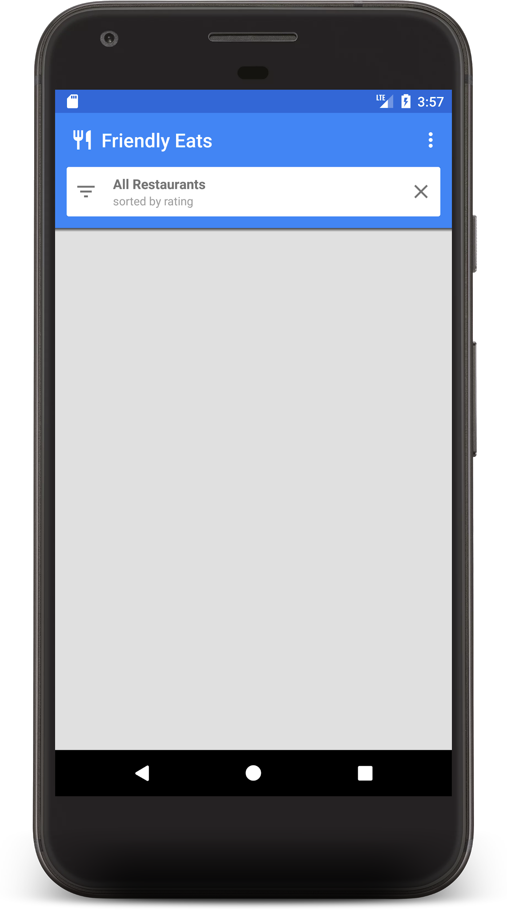

In the next section we will add some data to populate the home screen.


## Write data to Firestore
Duration: 5:00

In this section we will write some data to Firestore so that we can populate the home screen. You can enter data manually in the [Firebase console](https://console.firebase.google.com), but we'll do it in the app itself to demonstrate how to write data to Firestore using the Android SDK.

The main model object in our app is a restaurant (see `model/Restaurant.java`). Firestore data is split into documents, collections, and subcollections. We will store each restaurant as a document in a top-level collection called `"restaurants"`. To learn more about the Firestore data model, read about documents and collections in [the documentation](https://firebase.google.com/docs/firestore/data-model).

First, let's get an instance of `FirebaseFirestore` to work with. Edit the `initFirestore()` method in `MainActivity`:

```
    private void initFirestore() {
        mFirestore = FirebaseFirestore.getInstance();
    }
```

For demonstration purposes, we will add functionality in the app to create ten random restaurants when we click the "Add Random Items" button in the overflow menu. Fill in the `onAddItemsClicked()`:

```
    private void onAddItemsClicked() {
        // Get a reference to the restaurants collection
        CollectionReference restaurants = mFirestore.collection("restaurants");

        for (int i = 0; i < 10; i++) {
            // Get a random Restaurant POJO
            Restaurant restaurant = RestaurantUtil.getRandom(this);

            // Add a new document to the restaurants collection
            restaurants.add(restaurant);
        }
    }
```

There are a few important things to note about the code above:

*   We started by getting a reference to the `"restaurants"` collection. Collections are created implicitly when documents are added, so there was no need to create the collection before writing data.
*   Documents can be created using POJOs, which we use to create each Restaurant doc.
*   The `add()` method adds a document to a collection with an auto-generated ID, so we did not need to specify a unique ID for each Restaurant.

Now run the app again and click the "Add Random Items" button in the overflow menu to invoke the code you just wrote:

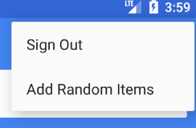

If you navigate to the [Firebase console](https://console.firebase.google.com/project/_/database/firestore/data), you should see the newly added data:

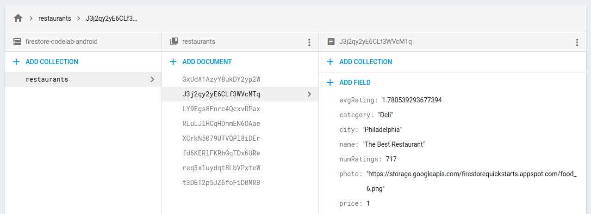

Congratulations, you just wrote data to Firestore! In the next step we'll learn how to display this data in the app.

## Display data from Firestore
Duration: 10:00

In this step we will learn how to retrieve data from Firestore and display it in our app. The first step to reading data from Firestore is to create a `Query`. Modify the `initFirestore()` method:

```
    private void initFirestore() {
        mFirestore = FirebaseFirestore.getInstance();

        // Get the 50 highest rated restaurants
        mQuery = mFirestore.collection("restaurants")
                .orderBy("avgRating", Query.Direction.DESCENDING)
                .limit(LIMIT);
    }
```

Now we want to listen to the query, so that we get all matching documents and are notified of future updates in real time. Because our eventual goal is to bind this data to a `RecyclerView`, we need to create a `RecyclerView.Adapter` class to listen to the data.

Open the `FirestoreAdapter` class, which has been partially implemented already. First, let's make the adapter implement `EventListener` and define the `onEvent` function so that it can receive updates to a Firestore query:

```
public abstract class FirestoreAdapter<VH extends RecyclerView.ViewHolder>
        extends RecyclerView.Adapter<VH>
        implements EventListener<QuerySnapshot> {

    // ...

    @Override
    public void onEvent(QuerySnapshot documentSnapshots,
                        FirebaseFirestoreException e) {

        // Handle errors
        if (e != null) {
            Log.w(TAG, "onEvent:error", e);
            return;
        }

        // Dispatch the event
        for (DocumentChange change : documentSnapshots.getDocumentChanges()) {
            // Snapshot of the changed document
            DocumentSnapshot snapshot = change.getDocument();

            switch (change.getType()) {
                case ADDED:
                    // TODO: handle document added
                    break;
                case MODIFIED:
                    // TODO: handle document modified
                    break;
                case REMOVED:
                    // TODO: handle document removed
                    break;
            }
        }

        onDataChanged();
    }

  // ...
}
```

On initial load the listener will receive one `ADDED` event for each new document. As the result set of the query changes over time the listener will receive more events containing the changes. Now let's finish implementing the listener. First add three new methods: `onDocumentAdded`, `onDocumentModified`, and on `onDocumentRemoved`:

```
    protected void onDocumentAdded(DocumentChange change) {
        mSnapshots.add(change.getNewIndex(), change.getDocument());
        notifyItemInserted(change.getNewIndex());
    }

    protected void onDocumentModified(DocumentChange change) {
        if (change.getOldIndex() == change.getNewIndex()) {
            // Item changed but remained in same position
            mSnapshots.set(change.getOldIndex(), change.getDocument());
            notifyItemChanged(change.getOldIndex());
        } else {
            // Item changed and changed position
            mSnapshots.remove(change.getOldIndex());
            mSnapshots.add(change.getNewIndex(), change.getDocument());
            notifyItemMoved(change.getOldIndex(), change.getNewIndex());
        }
    }

    protected void onDocumentRemoved(DocumentChange change) {
        mSnapshots.remove(change.getOldIndex());
        notifyItemRemoved(change.getOldIndex());
    }
```

Then call these new methods from `onEvent`:

```
    @Override
    public void onEvent(QuerySnapshot documentSnapshots,
                        FirebaseFirestoreException e) {

        // ...

        // Dispatch the event
        for (DocumentChange change : documentSnapshots.getDocumentChanges()) {
            // Snapshot of the changed document
            DocumentSnapshot snapshot = change.getDocument();

            switch (change.getType()) {
                case ADDED:
                    onDocumentAdded(change);
                    break;
                case MODIFIED:
                    onDocumentModified(change);
                    break;
                case REMOVED:
                    onDocumentRemoved(change);
                    break;
            }
        }

        onDataChanged();
    }

```

Finally implement the `startListening()` method to attach the listener:


```
    public void startListening() {
        if (mQuery != null && mRegistration == null) {
            mRegistration = mQuery.addSnapshotListener(this);
        }
    }
```

positive
: **Note**: this codelab demonstrates the real-time capabilities of Firestore, but it's also simple to fetch data without a listener. You can call get() on any query or reference to fetch a data snapshot.

Now the app is fully configured to read data from Firestore. **Run** the app again and you should see the restaurants you added in the previous step:

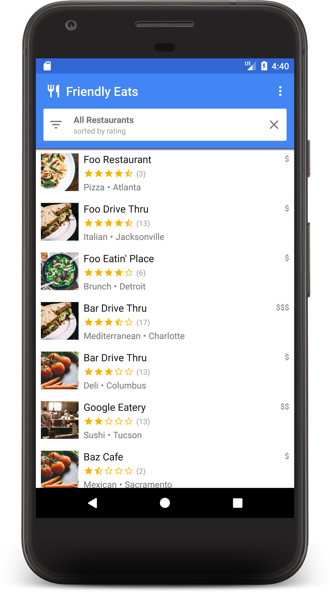

Now go back to the Firebase console and edit one of the restaurant names. You should see it change in the app almost instantly!


## Sort and filter data
Duration: 5:00

The app currently displays the top-rated restaurants across the entire collection, but in a real restaurant app the user would want to sort and filter the data. For example the app should be able to show "Top seafood restaurants in Philadelphia" or "Least expensive pizza".

Clicking white bar at the top of the app brings up a filters dialog. In this section we'll use Firestore queries to make this dialog work:

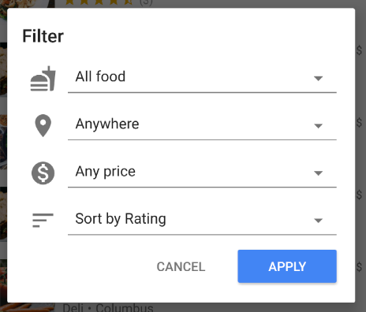

Let's edit the `onFilter()` method of `MainActivity.java`. This method accepts a `Filters` object which is a helper object we created to capture the output of the filters dialog. We will change this method to construct a query from the filters: \

```
    @Override
    public void onFilter(Filters filters) {
        // Construct query basic query
        Query query = mFirestore.collection("restaurants");

        // Category (equality filter)
        if (filters.hasCategory()) {
            query = query.whereEqualTo("category", filters.getCategory());
        }

        // City (equality filter)
        if (filters.hasCity()) {
            query = query.whereEqualTo("city", filters.getCity());
        }

        // Price (equality filter)
        if (filters.hasPrice()) {
            query = query.whereEqualTo("price", filters.getPrice());
        }

        // Sort by (orderBy with direction)
        if (filters.hasSortBy()) {
            query = query.orderBy(filters.getSortBy(), filters.getSortDirection());
        }

        // Limit items
        query = query.limit(LIMIT);

        // Update the query
        mQuery = query;
        mAdapter.setQuery(query);

        // Set header
        mCurrentSearchView.setText(Html.fromHtml(filters.getSearchDescription(this)));
        mCurrentSortByView.setText(filters.getOrderDescription(this));

        // Save filters
        mViewModel.setFilters(filters);
    }
```

In the snippet above we build a `Query` object by attaching `where` and `orderBy` clauses to match the given filters.

**Run** the app again and select the following filter to show the most popular low-price restaurants:

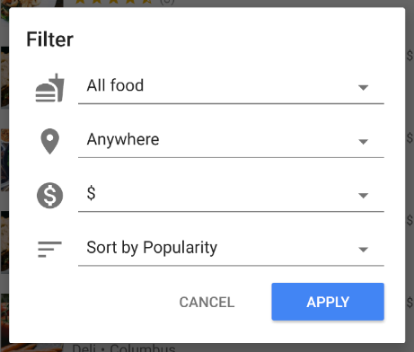

If you view the app logs using `adb logcat` or the **Logcat** panel in Android Studio, you will notice some warnings:

```
W/Firestore Adapter: onEvent:error
com.google.firebase.firestore.FirebaseFirestoreException: FAILED_PRECONDITION: The query requires an index. You can create it here: https://console.firebase.google.com/project/firestore-codelab-android/database/firestore/indexes?create_index=EgtyZXN0YXVyYW50cxoJCgVwcmljZRACGg4KCm51bVJhdGluZ3MQAxoMCghfX25hbWVfXxAD
    at com.google.android.gms.internal.ajs.zze(Unknown Source)
    // ...
```


The query could not be completed on the backend because it requires an index. Most Firestore queries involving multiple fields (in this case price and rating) require a custom index. Clicking the link in the error message will open the Firebase console and automatically prompt you to create the correct index:

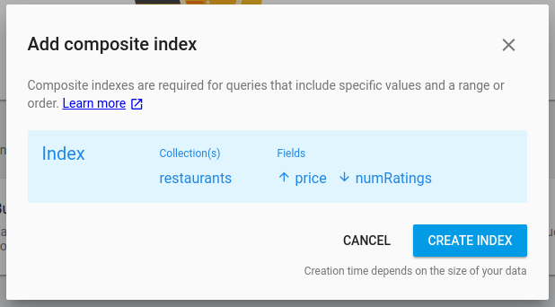

Clicking **Create Index** will begin creating the required index. When the index is complete your query should succeed:


positive
: **Note**: the Firestore Android SDK caches documents offline and will return those results in the event of a server error. If you execute a query without a matching index you may still see results in your UI but it's important to check the logs to make sure you have all required indexes.

Now that the proper index has been created, run the app again and execute the same query. You should now see a filtered list of restaurants containing only low-price options:

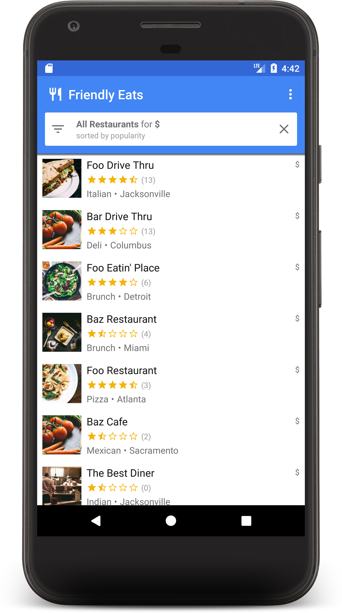

If you've made it this far, you have now built a fully functioning restaurant recommendation app on Firestore!  You can now sort and filter restaurants in real time. In the next few sections we add more features and security to the app.


## Organize data in subcollections
Duration: 5:00

In this section we'll add ratings to the app so users can review their favorite (or least favorite) restaurants.

### Collections and subcollections

So far we have stored all restaurant data in a top-level collection called "restaurants". When a user rates a restaurant we want to add a new `Rating` object to the restaurants. For this task we will use a subcollection. You can think of a subcollection as a collection that is attached to a document. So each restaurant document will have a ratings subcollection full of rating documents. Subcollections help organize data without bloating our documents or requiring complex queries.

To access a subcollection, call `.collection()` on the parent document:


```
CollectionReference subRef = mFirestore.collection("restaurants")
        .document("abc123")
        .collection("ratings");
```


You can access and query a subcollection just like with a top-level collection, there are no size limitations or performance changes. You can read more about the Firestore data model [here](https://firebase.google.com/docs/firestore/data-model).

### Writing data in a transaction

Adding a `Rating` to the proper subcollection only requires calling `.add()`, but we also need to update the `Restaurant` object's average rating and number of ratings to reflect the new data. If we use separate operations to make these two changes there are a number of race conditions that could result in stale or incorrect data.

To ensure that ratings are added properly, we will use a transaction to add ratings to a restaurant. This transaction will perform a few actions:

*   Read the restaurant's current rating and calculate the new one
*   Add the rating to the subcollection
*   Update the restaurant's average rating and number of ratings

Open `RestaurantDetailActivity.java` and implement the `addRating` function:


```
    private Task<Void> addRating(final DocumentReference restaurantRef,
                                 final Rating rating) {
        // Create reference for new rating, for use inside the transaction
        final DocumentReference ratingRef = restaurantRef.collection("ratings")
                .document();

        // In a transaction, add the new rating and update the aggregate totals
        return mFirestore.runTransaction(new Transaction.Function<Void>() {
            @Override
            public Void apply(Transaction transaction)
                    throws FirebaseFirestoreException {

                Restaurant restaurant = transaction.get(restaurantRef)
                        .toObject(Restaurant.class);

                // Compute new number of ratings
                int newNumRatings = restaurant.getNumRatings() + 1;

                // Compute new average rating
                double oldRatingTotal = restaurant.getAvgRating() *
                        restaurant.getNumRatings();
                double newAvgRating = (oldRatingTotal + rating.getRating()) /
                        newNumRatings;

                // Set new restaurant info
                restaurant.setNumRatings(newNumRatings);
                restaurant.setAvgRating(newAvgRating);

                // Commit to Firestore
                transaction.set(restaurantRef, restaurant);
                transaction.set(ratingRef, rating);

                return null;
            }
        });
    }
```

The `addRating()` function returns a `Task` representing the entire transaction. In the `onRating()` function listeners are added to the task to respond to the result of the transaction.

Now **Run** the app again and click on one of the restaurants, which should bring up the restaurant detail screen. Click the **+** button to start adding a review. Add a review by picking a number of stars and entering some text.

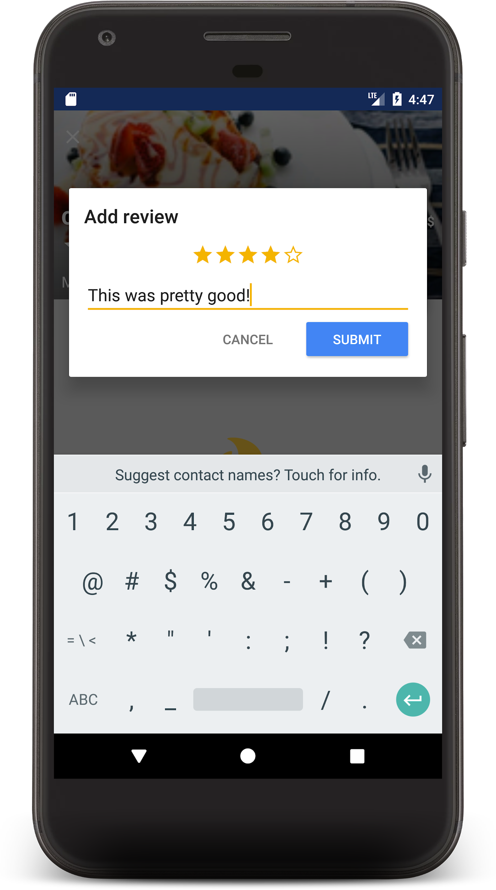

Hitting **Submit** will kick off the transaction. When the transaction completes, you will see your review displayed below and an update to the restaurant's review count:

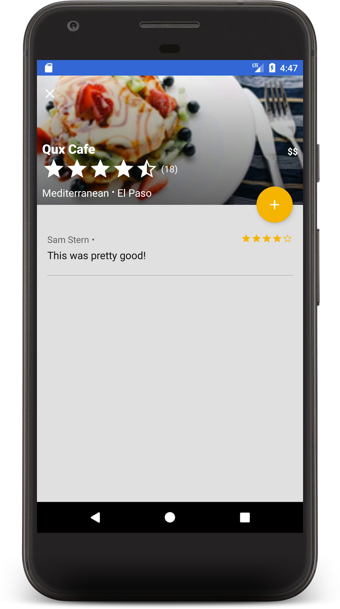

Congrats!  You now have a social, local, mobile restaurant review app built on Cloud Firestore. I hear those are very popular these days.


## Secure your data
Duration: 5:00

At the beginning of this codelab we set our app's security rules to prevent unauthenticated access. In a real application we'd want to set much more fine-grained rules to prevent undesirable data access or modification. Open the rules tab of the console and change the security rules to the following:

negative
: **Note**: rules changes can take 1-5 minutes to take effect.

```
service cloud.firestore {
  match /databases/{database}/documents {
        // Restaurants:
        //   - Authenticated user can read
        //   - Authenticated user can create/update (for demo)
        //   - Validate updates
        //   - Deletes are not allowed
    match /restaurants/{restaurantId} {
      allow read, create: if request.auth.uid != null;
      allow update: if request.auth.uid != null
                    && request.resource.data.name == resource.data.name
      allow delete: if false;
     
      // Ratings:
      //   - Authenticated user can read
      //   - Authenticated user can create if userId matches
      //   - Deletes and updates are not allowed
      match /ratings/{ratingId} {
        allow read: if request.auth.uid != null;
        allow create: if request.auth.uid != null
                      && request.resource.data.userId == request.auth.uid;
        allow update, delete: if false;
       
        }
    }
  }
}
```

These rules restrict access to ensure that clients only make safe changes. For example updates to a restaurant document can only change the ratings, not the name or any other immutable data. Ratings can only be created if the user ID matches the signed-in user, which prevents spoofing.

To read more about Security Rules, visit [the documentation](https://firebase.google.com/docs/firestore/security/secure-data).

## Conclusion
Duration: 1:00

You have now created a fully-featured app on top of Firestore. You learned about the most important Firestore features including:

*   Documents and collections
*   Reading and writing data
*   Sorting and filtering with queries
*   Subcollections
*   Transactions

The restaurant app in this codelab was based on the "Friendly Eats" example application. You can browse the source code for that app [here](https://github.com/firebase/quickstart-android).

If you want to keep learning about Firestore, here are some good places to get started:

*   [Choose a data structure](https://firebase.google.com/docs/firestore/manage-data/structure-data)
*   [Simple and compound queries](https://firebase.google.com/docs/firestore/query-data/queries)
